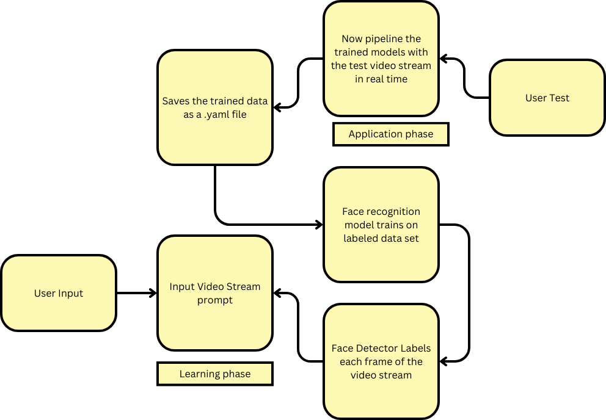

# OpenCV Face Detection and Recognition

Welcome to the OpenCV Face Detection and Recognition project! This project focuses on leveraging OpenCV's capabilities for image manipulation, specifically in the domain of face detection and recognition using the HAAR Cascade algorithm.

## Overview

Our system takes video streams as input, automatically trains itself on sample data, and becomes proficient in recognizing faces within the provided data. The project is designed for ease of use and integration into various applications requiring facial recognition features.

<p align="center">
  
</p>

## Features

- **Face Detection:** Utilizing the HAAR Cascade algorithm, our system identifies and locates faces within a given video stream.

- **Face Recognition:** Through automatic training on sample data, the system becomes adept at recognizing faces and associating them with predefined labels.

- **Easy Integration:** The project provides a simple and accessible interface for incorporating facial recognition into your applications.

## Future Work

Our commitment to innovation doesn't stop here. We have exciting plans for the future, including:

### Depth View Data Extraction

In the upcoming phases, we aim to enhance our system's capabilities by incorporating depth view data extraction. This addition will bring a new dimension to facial analysis, providing richer insights and expanding the potential applications of our project.

## Getting Started

1. Clone the repository:

   ```bash
   git clone https://github.com/your-username/opencv-face-recognition.git
